# CONVERT ANY WEBSITE INTO A NATIVE ANDROID APP

- Convert any website into a native Android App using Android Studio and WebView. Includes file uploads, downloads, camera & microphone permissions, printing support, and a clean native app interface.
- This project is ideal for developers who want to quickly transform a website into a professional mobile application using **Android Studio and Java**.

## Why This Project Exists
- Many developers and businesses already have functional websites but need a mobile application to reach Android users. Building a fully native Android application from scratch can be time-consuming and expensive.  

- This project provides a simple solution by allowing developers to convert an existing website into a native Android application using WebView.  

- Instead of rewriting the entire platform in Java or Kotlin, the application loads the existing website inside a secure WebView container while still supporting important native device features such as file uploads, downloads, printing, and media access.  

- The goal of this repository is to provide a **clean, lightweight, and production-ready Android WebView template** that developers can easily customize and deploy.

## PREREQUISITES
> [!IMPORTANT]
> Before you start, ensure you have `Android Studio` installed in your computer (It is recommended to use the **latest stable version** with all required SDK components and dependencies properly configured.).
> If not, install the latest version of Android Studio from the official site👉: [Android Studio Download](https://developer.android.com/studio) 

### KEY FEATURES INCLUDED IN THE APK
1. `Native WebView Website Wrapper`: Allows users to load any website directly inside an Android application with optimized WebView settings and compatibility. The app integrates WebView Cache management which improves loading performance and ensures efficient resource management.
---

2. `Printing Support`: the app integrates the Android **Print Framework**, allowing users to print web pages directly from the app. Web pages can trigger printing through a **JavaScript-to-native interface bridge**.
---

3. `File Upload support`: The app integrates a  modern **Android file picker**, enabling users to upload files directly from their device storage to the website.
Supported file types include:
- Documents
- Images
- Media files
---

4. `Camera and Microphone Access:` Web pages running inside the WebView can access device hardware when required.
Permissions supported:
- Camera access
- Microphone access

This enables functionality such as:
- Image capture
- Video uploads
- Voice recording
- Media forms
---

5. `Built-in File Download System`: The app integrates Android's **DownloadManager**, allowing users to download files directly from the website.

Downloaded files:
- Are saved to the device **Downloads folder**
- Display download progress notifications
- Can be accessed using the device file manager
---

6. `JavaScript-to-Native Communication Bridge`: The app includes a **JavaScript interface bridge**, allowing web pages to interact with Android native functionality.

This bridge can be used for actions such as:
- Triggering print operations
- Executing native Android features
- Creating deeper integration between the website and the app
---

7. `Native Mobile Interface`: The app removes traditional browser UI components to provide a **clean and fully immersive mobile app experience**.

Features include:
- No browser toolbar
- No address bar
- Full-screen WebView layout
---

8. `Custom Splash Screen`: The app uses a **custom splash screen** with:
- App logo
- Text animations
- Custom gradient colors
- Smooth startup transition
---

## Application Permissions
- The application requests several permissions required for native functionality.

| Permission     | Purpose                                     |
| -------------- | ------------------------------------------- |
| Camera         | Allows websites to capture photos or videos |
| Microphone     | Enables voice recording features            |
| Storage Access | Allows file uploads and downloads           |
| Notifications  | Displays download completion alerts         |

---


# STEP BY STEP CONFIGURATION
1. Open Android Studio. (a). Click the Menu icon ≣ (top left) then choose: `File>New Project`. 
(b). Select `No Activity` then click Next (as shown below):
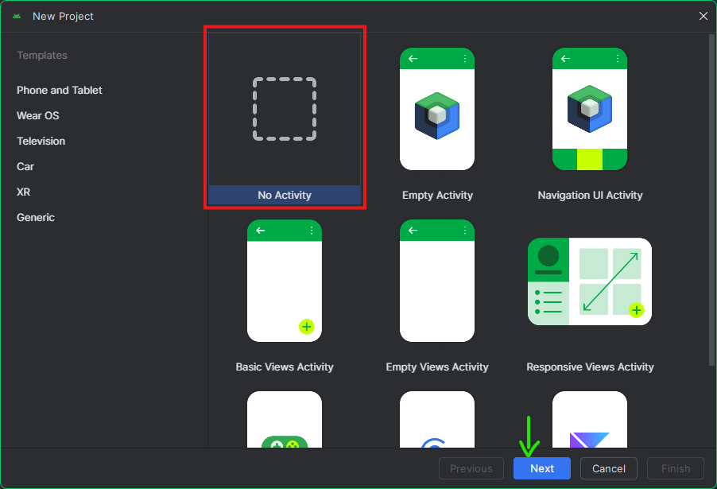

---

2. Apply the correct details for your app in the following window then click ***Finish***:   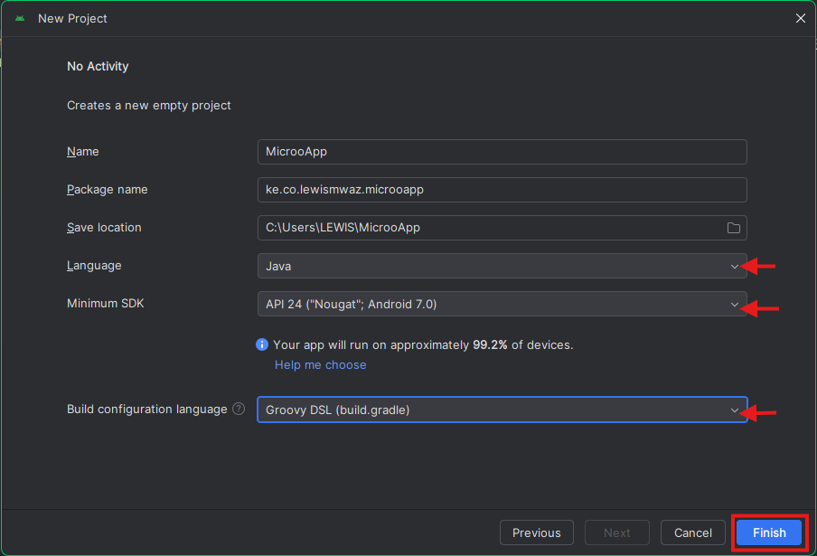
> [!IMPORTANT]
> 1. `Name` is the name that will be displayed in the android launcher of the app e.g., Tiktok
> 2. `Package name` should be ***your-site.app-name*** where `your-site` is inverted and `app-name` is in lowercase. For instance, if *your site*= `lewismwaz.com` and *app-name*=MicrooApp, then `Package name` should be `com.lewismwaz.microoapp`.
> 3. Select `Java` as the primary **Language**.
> 4. Ensure no directory/path exists with App name (in this case **MicrooApp**) before clicking the *Finish* button. The recommended `Save location` is `C:\Users`.
> 5. Ensure minimum SDK is set to the lowest ...Android 7.0 to support most android devices.
> 6. Set build configuration language as `Groovy DSL (build.gradle)` since we'll use Java.

---

3. Wait till ***Generating sources*** and ***Importing Gradle Project*** (shown at the bottom) is complete. You'll get a notification (bottom-right) "*Microsoft Defender may affect IDE*". Select **Exclude Folders**. When done, change the `Android` view to `Project` view (as shown below) by clicking in the area marked with a green arrow:
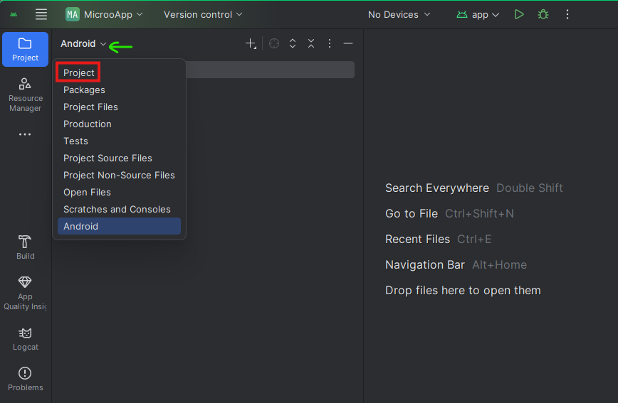
You should get a view similar to the one below. Click the drop-downs as shown with the arrows (red to expand) and (green to collapse). You should see a folder inside `java` with a typical package name as the one below:
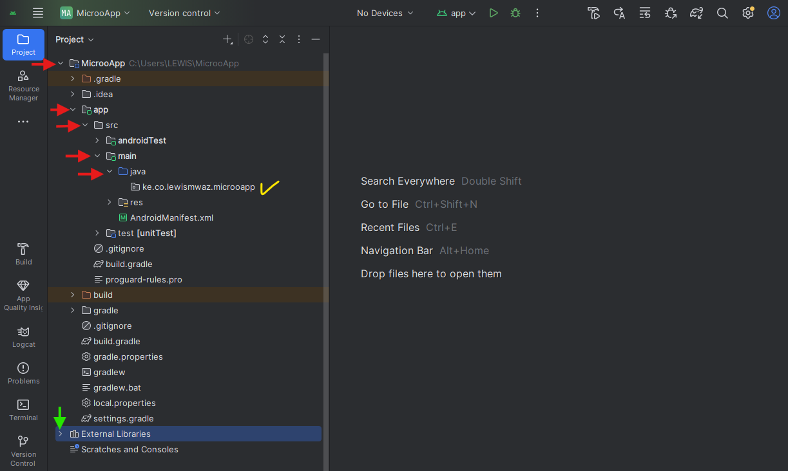

---

4. (a). Right-click on the `package name` (in this case: *ke.co.lewismwaz.microoapp*) then select: New>Activity>Empty Views Activity. Rename the Activity Name to `MainActivity`. Leave all the other options as shown below then click **Finish**: 
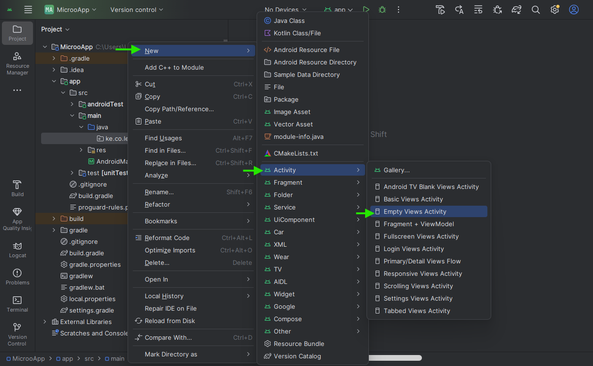
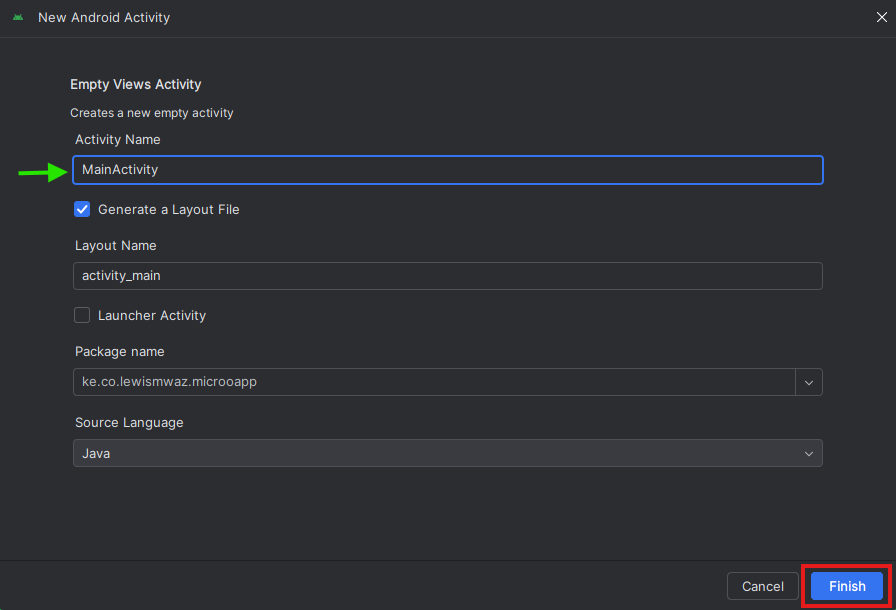
(b). Right-click on the `package name` again, then select: `New >Activity>Empty Views Activity`, type `SplashActivity` then press Enter. Activity name should be `SplashActivity`. Same options just like for `MainActivity` in 4(a) above. Click **Finish**.
(c). Right-click on the `package name` again, then select: `New >Java Class`, type `NetworkUtils` then press Enter. 
You should end up with something like (below):
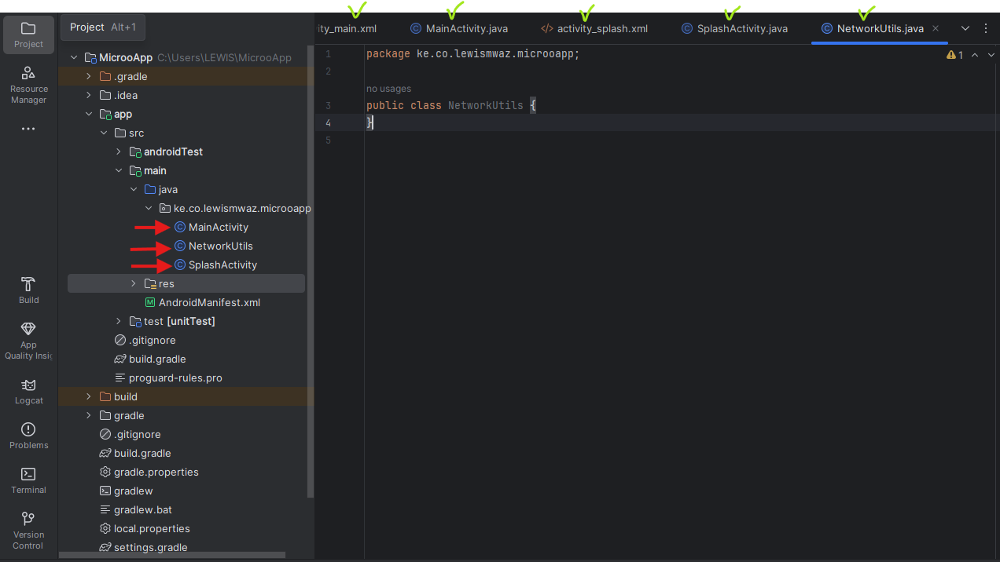

---

5. (a). Open `MainActivity.java`. Replace all the code **below** the package (in this case "*package ke.co.ke.lewismwaz.microoapp;*") with:
```java
import android.Manifest;  
import android.annotation.SuppressLint;  
import android.app.DownloadManager;  
import android.content.Intent;  
import android.net.Uri;  
import android.os.Build;  
import android.os.Bundle;  
import android.os.Environment;  
import android.print.PrintAttributes;  
import android.print.PrintManager;  
import android.view.View;  
import android.webkit.CookieManager;  
import android.webkit.JavascriptInterface;  
import android.webkit.PermissionRequest;  
import android.webkit.URLUtil;  
import android.webkit.ValueCallback;  
import android.webkit.WebChromeClient;  
import android.webkit.WebResourceRequest;  
import android.webkit.WebSettings;  
import android.webkit.WebView;  
import android.webkit.WebViewClient;  
import android.widget.Toast;  
  
import androidx.activity.OnBackPressedCallback;  
import androidx.activity.result.ActivityResultLauncher;  
import androidx.activity.result.contract.ActivityResultContracts;  
import androidx.appcompat.app.AlertDialog;  
import androidx.appcompat.app.AppCompatActivity;  
import androidx.core.app.ActivityCompat;  
  
public class MainActivity extends AppCompatActivity {  
  
    private static final String WEBSITE_URL = "https://lewismwaz.co.ke/index.php";  
    private static final int PERMISSION_REQUEST_CODE = 101;  
  
    private WebView webView;  
    private ValueCallback<Uri[]> fileUploadCallback;  
  
    /* ---------- FILE PICKER (MODERN API) ---------- */  
    private final ActivityResultLauncher<Intent> fileChooserLauncher =  
            registerForActivityResult(  
                    new ActivityResultContracts.StartActivityForResult(),  
                    result -> {  
                        if (fileUploadCallback == null) return;  
  
                        Uri[] uris = WebChromeClient.FileChooserParams  
                                .parseResult(result.getResultCode(), result.getData());  
  
                        fileUploadCallback.onReceiveValue(uris);  
                        fileUploadCallback = null;  
                    }  
            );  
  
    @SuppressLint("SetJavaScriptEnabled")  
    @Override  
    protected void onCreate(Bundle savedInstanceState) {  
        super.onCreate(savedInstanceState);  
  
        if (getSupportActionBar() != null) getSupportActionBar().hide();  
  
        setContentView(R.layout.activity_main);  
        webView = findViewById(R.id.webView);  
  
        requestRuntimePermissions();  
        setupWebView();  
        loadWebsite();  
        setupBackPressedHandler();  
        setupDownloads();  
    }  
  
    /* ---------- PERMISSIONS ---------- */  
    private void requestRuntimePermissions() {  
        if (Build.VERSION.SDK_INT >= 33) {  
            ActivityCompat.requestPermissions(  
                    this,  
                    new String[]{  
                            Manifest.permission.CAMERA,  
                            Manifest.permission.RECORD_AUDIO,  
                            Manifest.permission.POST_NOTIFICATIONS  
                    },  
                    PERMISSION_REQUEST_CODE  
            );  
        }  
    }  
  
    /* ---------- WEBVIEW SETUP ---------- */  
    @SuppressLint("SetJavaScriptEnabled")  
    private void setupWebView() {  
        WebSettings settings = webView.getSettings();  
  
        settings.setJavaScriptEnabled(true);  
        settings.setDomStorageEnabled(true);  
        settings.setMediaPlaybackRequiresUserGesture(false);  
        settings.setCacheMode(WebSettings.LOAD_DEFAULT);  
  
        settings.setUseWideViewPort(true);  
        settings.setLoadWithOverviewMode(true);  
  
        settings.setBuiltInZoomControls(false);  
        settings.setDisplayZoomControls(false);  
  
        webView.setOverScrollMode(View.OVER_SCROLL_NEVER);  
  
        // JavaScript bridge for printing  
        webView.addJavascriptInterface(new WebAppBridge(), "Android");  
  
        webView.setWebViewClient(new NativeWebViewClient());  
        webView.setWebChromeClient(new NativeWebChromeClient());  
    }  
  
    /* ---------- LOAD SITE ---------- */  
    private void loadWebsite() {  
        if (NetworkUtils.isNetworkAvailable(this)) {  
            webView.loadUrl(WEBSITE_URL);  
        } else {  
            Toast.makeText(this, "No internet connection.", Toast.LENGTH_LONG).show();  
        }  
    }  
  
    /* ---------- DOWNLOAD SUPPORT ---------- */  
    private void setupDownloads() {  
        webView.setDownloadListener((url, userAgent, contentDisposition, mimeType, contentLength) -> {  
  
            DownloadManager.Request request = new DownloadManager.Request(Uri.parse(url));  
            request.setMimeType(mimeType);  
  
            String cookies = CookieManager.getInstance().getCookie(url);  
            request.addRequestHeader("cookie", cookies);  
            request.addRequestHeader("User-Agent", userAgent);  
  
            request.setTitle(URLUtil.guessFileName(url, contentDisposition, mimeType));  
            request.setDescription("Downloading...");  
            request.setNotificationVisibility(  
                    DownloadManager.Request.VISIBILITY_VISIBLE_NOTIFY_COMPLETED  
            );  
            request.setDestinationInExternalPublicDir(  
                    Environment.DIRECTORY_DOWNLOADS,  
                    URLUtil.guessFileName(url, contentDisposition, mimeType)  
            );  
  
            DownloadManager dm = (DownloadManager) getSystemService(DOWNLOAD_SERVICE);  
            dm.enqueue(request);  
  
            Toast.makeText(this, "Downloading file...", Toast.LENGTH_SHORT).show();  
        });  
    }  
  
    /* ---------- BACK BUTTON ---------- */  
    private void setupBackPressedHandler() {  
        getOnBackPressedDispatcher().addCallback(this, new OnBackPressedCallback(true) {  
            @Override  
            public void handleOnBackPressed() {  
                if (webView.canGoBack()) {  
                    webView.goBack();  
                } else {  
                    new AlertDialog.Builder(MainActivity.this)  
                            .setTitle("Exit MicrooApp")  
                            .setMessage("Do you want to exit?")  
                            .setPositiveButton("Exit", (d, w) -> finish())  
                            .setNegativeButton("Cancel", null)  
                            .show();  
                }  
            }  
        });  
    }  
  
    /* ---------- PRINT IMPLEMENTATION ---------- */  
    private void printPage() {  
        PrintManager printManager = (PrintManager) getSystemService(PRINT_SERVICE);  
  
        PrintAttributes attributes = new PrintAttributes.Builder()  
                .setMediaSize(PrintAttributes.MediaSize.ISO_A4)  
                .setColorMode(PrintAttributes.COLOR_MODE_COLOR)  
                .build();  
  
        printManager.print(  
                "MicrooApp_Page",  
                webView.createPrintDocumentAdapter("MicrooApp"),  
                attributes  
        );  
    }  
  
    /* ---------- JS → NATIVE BRIDGE ---------- */  
    private class WebAppBridge {  
  
        @JavascriptInterface  
        @SuppressWarnings("unused")  
        public void printPage() {  
            runOnUiThread(MainActivity.this::printPage);  
        }  
    }  
  
    /* ---------- WEBVIEW CLIENT ---------- */  
    private static class NativeWebViewClient extends WebViewClient {  
        @Override  
        public boolean shouldOverrideUrlLoading(WebView view, WebResourceRequest request) {  
            String url = request.getUrl().toString();  
  
            if (url.startsWith("tel:")  
                    || url.startsWith("mailto:")  
                    || url.startsWith("sms:")) {  
  
                view.getContext().startActivity(  
                        new Intent(Intent.ACTION_VIEW, Uri.parse(url))  
                );  
                return true;  
            }  
            return false;  
        }  
    }  
  
    /* ---------- CHROME CLIENT ---------- */  
    private class NativeWebChromeClient extends WebChromeClient {  
  
        @Override  
        public void onPermissionRequest(PermissionRequest request) {  
            request.grant(request.getResources());  
        }  
  
        @Override  
        public boolean onShowFileChooser(  
                WebView webView,  
                ValueCallback<Uri[]> filePathCallback,  
                FileChooserParams fileChooserParams) {  
  
            fileUploadCallback = filePathCallback;  
            fileChooserLauncher.launch(fileChooserParams.createIntent());  
            return true;  
        }  
    }  
}
```

(b). Navigate to the line: 
```java
private static final String WEBSITE_URL = "https://lewismwaz.co.ke/index.php"
```
and replace `https://lewismwaz.co.ke/index.php` with the actual link to the root/home of your website (First page users should see after the splash screen loads).

(c). Navigate to the code: 
```java
public void handleOnBackPressed() {  
                if (webView.canGoBack()) {  
                    webView.goBack();  
                } else {  
                    new AlertDialog.Builder(MainActivity.this)  
                            .setTitle("Exit MicrooApp")  
                            .setMessage("Do you want to exit?")  
                            .setPositiveButton("Exit", (d, w) -> finish())  
                            .setNegativeButton("Cancel", null)  
                            .show();  
                }  
            }  
```
Replace `Exit MicrooApp` with `Exit YourAppName`.

(d). Navigate to the code:
```java
/* ---------- PRINT IMPLEMENTATION ---------- */  
    private void printPage() {  
        PrintManager printManager = (PrintManager) getSystemService(PRINT_SERVICE);  
  
        PrintAttributes attributes = new PrintAttributes.Builder()  
                .setMediaSize(PrintAttributes.MediaSize.ISO_A4)  
                .setColorMode(PrintAttributes.COLOR_MODE_COLOR)  
                .build();  
  
        printManager.print(  
                "MicrooApp_Page",  
                webView.createPrintDocumentAdapter("MicrooApp"),  
                attributes  
        );  
    }  
```
Replace `MicrooApp_Page` with `YourAppName_Page` and `MicrooApp` with `YourAppName`. The `MainActivity.java` should now be looking good!

---

6. Open `NetworkUtils.java`. Replace all the code **below** the package (in this case "*package ke.co.ke.lewismwaz.microoapp;*") with:
```java
import android.content.Context;  
import android.net.ConnectivityManager;  
import android.net.Network;  
import android.net.NetworkCapabilities;  
  
public class NetworkUtils {  
    public static boolean isNetworkAvailable(Context context) {  
        ConnectivityManager connectivityManager =  
                (ConnectivityManager) context.getSystemService(Context.CONNECTIVITY_SERVICE);  
  
        if (connectivityManager != null) {  
            Network network = connectivityManager.getActiveNetwork();  
            if (network == null) return false;  
            NetworkCapabilities capabilities = connectivityManager.getNetworkCapabilities(network);  
            return capabilities != null &&  
                    capabilities.hasCapability(NetworkCapabilities.NET_CAPABILITY_INTERNET);  
        }  
        return false;  
    }  
}
```

---

7. Open `SplashActivity.java`. Replace all the code **below** the package (in this case "*package ke.co.ke.lewismwaz.microoapp;*") with:
```java
import androidx.appcompat.app.AppCompatActivity;  
  
import android.annotation.SuppressLint;  
import android.content.Intent;  
import android.os.Bundle;  
import android.os.Handler;  
import android.util.Log;  
import android.view.Window;  
import android.view.WindowManager;  
import android.view.animation.Animation;  
import android.view.animation.AnimationUtils;  
import android.widget.ImageView;  
import android.widget.TextView;  
  
@SuppressLint("CustomSplashScreen")  
public class SplashActivity extends AppCompatActivity {  
  
    private static final String TAG = "SplashActivity";  
    private static final int SPLASH_DURATION = 3000; // 3 seconds  
  
    private ImageView logoImageView;  
    private TextView sloganTextView;  
  
    @Override  
    protected void onCreate(Bundle savedInstanceState) {  
        super.onCreate(savedInstanceState);  
  
        Window window = getWindow();  
        window.addFlags(WindowManager.LayoutParams.FLAG_FULLSCREEN);  
  
        setContentView(R.layout.activity_splash);  
  
        // Initialize views  
        logoImageView = findViewById(R.id.logoImageView);  
        sloganTextView = findViewById(R.id.sloganTextView);  
  
        // Start animations  
        startAnimations();  
  
        // Start splash screen timer  
        startSplashTimer();  
    }  
  
    private void startAnimations() {  
        // Load animations  
        Animation scaleUpAnimation = AnimationUtils.loadAnimation(this, R.anim.scale_up);  
        Animation fadeInAnimation = AnimationUtils.loadAnimation(this, R.anim.fade_in);  
        Animation pulseAnimation = AnimationUtils.loadAnimation(this, R.anim.pulse);  
  
        // Start logo animation immediately  
        logoImageView.startAnimation(scaleUpAnimation);  
  
        // Start slogan animation with a slight delay  
        new Handler().postDelayed(() -> {  
            sloganTextView.startAnimation(fadeInAnimation);  
  
            // Start pulsing animation after fade in completes  
            new Handler().postDelayed(() -> sloganTextView.startAnimation(pulseAnimation), 1500);  
        }, 500);  
    }  
  
    private void startSplashTimer() {  
        new Handler().postDelayed(() -> {  
            try {  
                startActivity(new Intent(SplashActivity.this, MainActivity.class));  
                overridePendingTransition(android.R.anim.fade_in, android.R.anim.fade_out);  
                finish();  
            } catch (Exception e) {  
                Log.e(TAG, "Error starting MainActivity: " + e.getMessage(), e);  
                finish();  
            }  
        }, SPLASH_DURATION);  
    }  
  
    @Override  
    protected void onDestroy() {  
        // Clear animations to prevent memory leaks  
        if (logoImageView != null) {  
            logoImageView.clearAnimation();  
        }  
        if (sloganTextView != null) {  
            sloganTextView.clearAnimation();  
        }  
        super.onDestroy();  
    }  
}
```

---

8. Expand the `res` directory. Right-click on it: New>Android Resource Directory. Name it `anim` (as shown below):
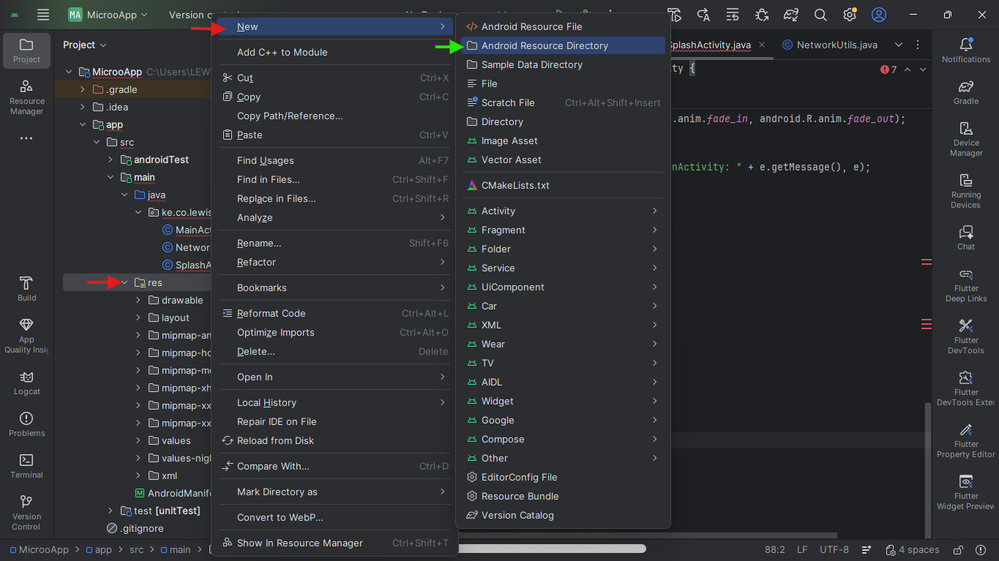
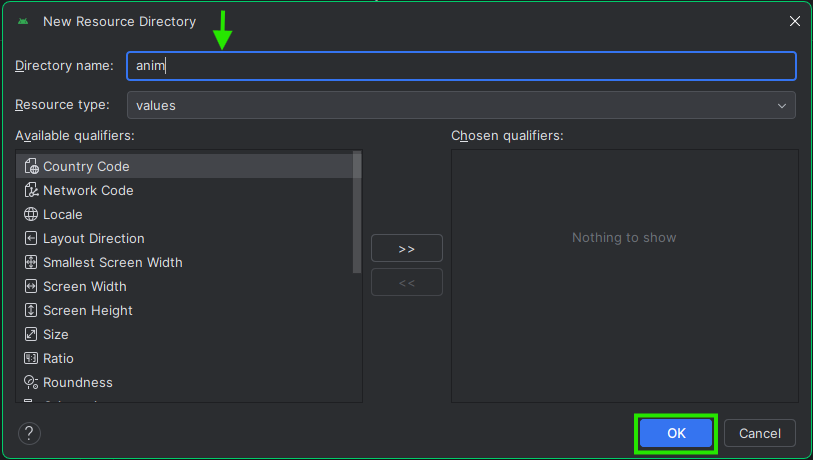
The `res` directory should now look like this + `anim` directory:
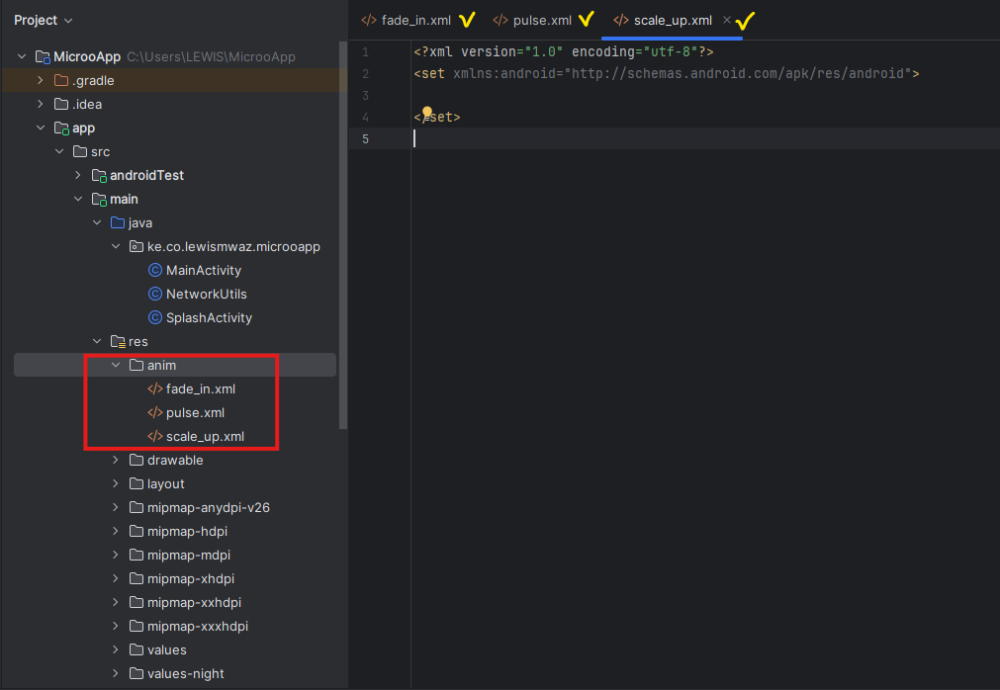

(b). Right-click on `anim` directory then select: New>Animation Resource File:
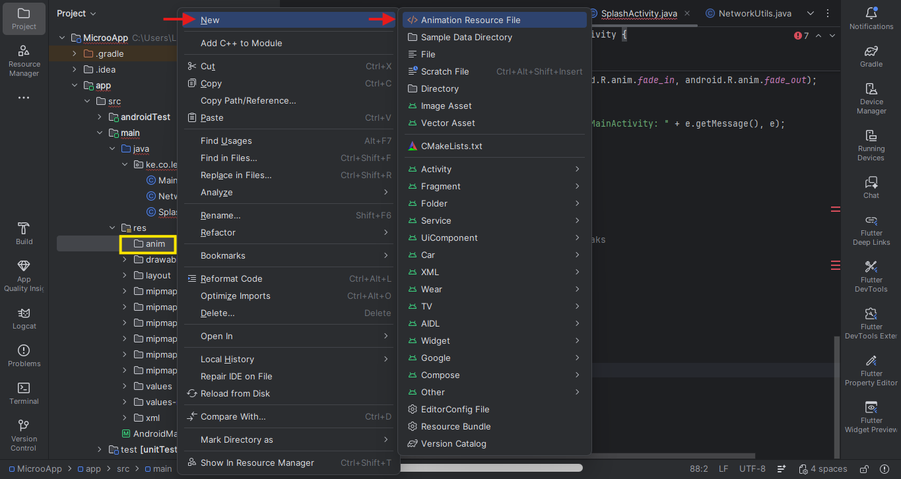  

Give it a filename `fade_in` then click **OK**:  
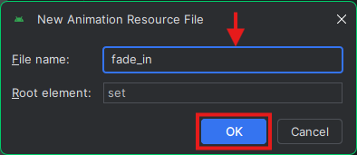

(c). Repeat the same process to create `pulse` and `scale_up` animation resource files.

---

9. Replace **All** the code in the files `fade_in.xml`, `pulse.xml` and `scale_up.xml` with the code below:
(a). `fade_in.xml`:
```xml
<?xml version="1.0" encoding="utf-8"?>  
<set xmlns:android="http://schemas.android.com/apk/res/android"  
    android:fillAfter="true">  
  
    <alpha        android:fromAlpha="0.0"  
        android:toAlpha="1.0"  
        android:duration="1500" />  
  
    <translate        android:fromYDelta="20"  
        android:toYDelta="0"  
        android:duration="1500" />  
</set>
```

(b). `pulse.xml`:
```xml
<?xml version="1.0" encoding="utf-8"?>  
<set xmlns:android="http://schemas.android.com/apk/res/android"  
    android:fillAfter="true"  
    android:repeatMode="reverse"  
    android:repeatCount="infinite">  
  
    <scale        android:fromXScale="1.0"  
        android:toXScale="1.05"  
        android:fromYScale="1.0"  
        android:toYScale="1.05"  
        android:pivotX="50%"  
        android:pivotY="50%"  
        android:duration="1000" />  
  
    <alpha        android:fromAlpha="1.0"  
        android:toAlpha="0.8"  
        android:duration="1000" />  
</set>
```

(c). `scale_up.xml`:
```xml
<?xml version="1.0" encoding="utf-8"?>  
<set xmlns:android="http://schemas.android.com/apk/res/android"  
    android:fillAfter="true">  
  
    <scale        android:fromXScale="0.8"  
        android:toXScale="1.0"  
        android:fromYScale="0.8"  
        android:toYScale="1.0"  
        android:pivotX="50%"  
        android:pivotY="50%"  
        android:duration="1500" />  
  
    <alpha        android:fromAlpha="0.5"  
        android:toAlpha="1.0"  
        android:duration="1500" />  
</set>
```

---

10. (a) Expand the `drawable` directory. Right-click on it then select: New> Drawable Resource File:
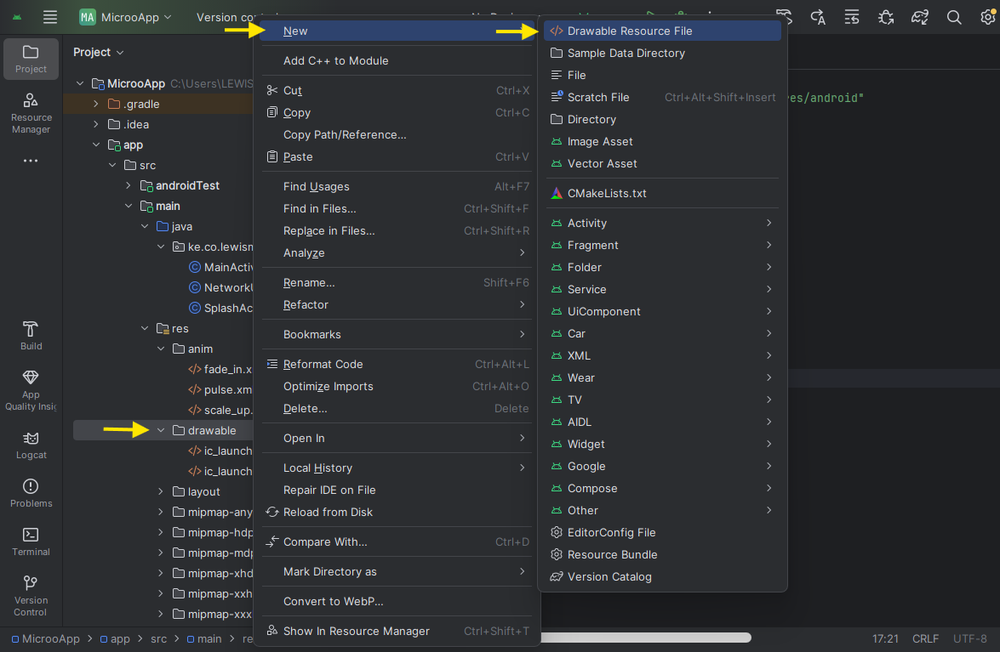
  
  Give it a file name `linear_background`:  
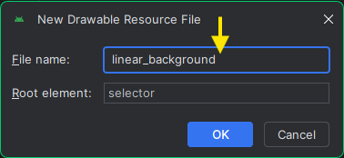

(b). Repeat the same process as 10(a) to create `text_gradient.xml` file.

(c). Create a *logo* (image) with a transparent-background for your app. When you already have the app logo, to freely remove image background head here 👉 [Remove.bg](https://remove.bg) , upload your logo, then click the button `Download Preview` to download your no-bg-logo. Resize the logo image to be small for small/mobile devices (Recommended size: 150X150). The image file must be a ***.png*** file. Rename the image as `logo` thus should be logo.png, then copy it and paste it inside `drawable` directory.

The new `drawable` directory structure should now be similar to the one shown below:
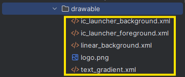

---


***NB:*** For the next step (11), ensure to switch to `Code` view as shown below:
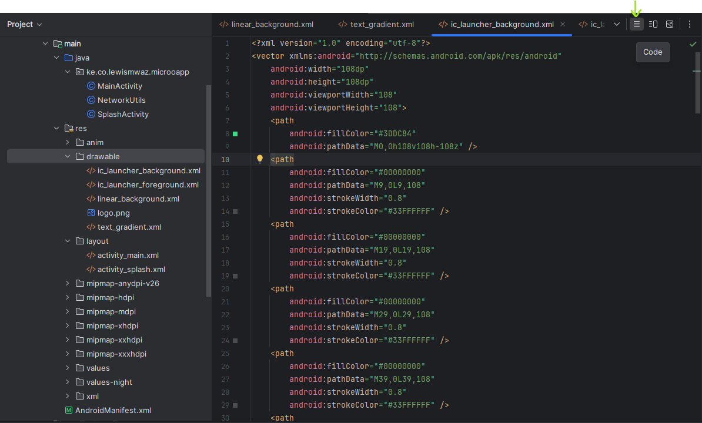

11. Replace **All** the code in the files `ic_launcher_background.xml`, `ic_launcher_foreground.xml`, `linear_background.xml` and `text_gradient.xml` with the code below:
> [!NOTE]
> The code in the files below will be used to style the Splash Screen of the app.

(a). `ic_launcher_background.xml`:
```xml
<?xml version="1.0" encoding="utf-8"?>  
<vector xmlns:android="http://schemas.android.com/apk/res/android"  
    android:width="108dp"  
    android:height="108dp"  
    android:viewportWidth="108"  
    android:viewportHeight="108">  
    <path        android:fillColor="#3DDC84"  
        android:pathData="M0,0h108v108h-108z" />  
    <path        android:fillColor="#00000000"  
        android:pathData="M9,0L9,108"  
        android:strokeWidth="0.8"  
        android:strokeColor="#33FFFFFF" />  
    <path        android:fillColor="#00000000"  
        android:pathData="M19,0L19,108"  
        android:strokeWidth="0.8"  
        android:strokeColor="#33FFFFFF" />  
    <path        android:fillColor="#00000000"  
        android:pathData="M29,0L29,108"  
        android:strokeWidth="0.8"  
        android:strokeColor="#33FFFFFF" />  
    <path        android:fillColor="#00000000"  
        android:pathData="M39,0L39,108"  
        android:strokeWidth="0.8"  
        android:strokeColor="#33FFFFFF" />  
    <path        android:fillColor="#00000000"  
        android:pathData="M49,0L49,108"  
        android:strokeWidth="0.8"  
        android:strokeColor="#33FFFFFF" />  
    <path        android:fillColor="#00000000"  
        android:pathData="M59,0L59,108"  
        android:strokeWidth="0.8"  
        android:strokeColor="#33FFFFFF" />  
    <path        android:fillColor="#00000000"  
        android:pathData="M69,0L69,108"  
        android:strokeWidth="0.8"  
        android:strokeColor="#33FFFFFF" />  
    <path        android:fillColor="#00000000"  
        android:pathData="M79,0L79,108"  
        android:strokeWidth="0.8"  
        android:strokeColor="#33FFFFFF" />  
    <path        android:fillColor="#00000000"  
        android:pathData="M89,0L89,108"  
        android:strokeWidth="0.8"  
        android:strokeColor="#33FFFFFF" />  
    <path        android:fillColor="#00000000"  
        android:pathData="M99,0L99,108"  
        android:strokeWidth="0.8"  
        android:strokeColor="#33FFFFFF" />  
    <path        android:fillColor="#00000000"  
        android:pathData="M0,9L108,9"  
        android:strokeWidth="0.8"  
        android:strokeColor="#33FFFFFF" />  
    <path        android:fillColor="#00000000"  
        android:pathData="M0,19L108,19"  
        android:strokeWidth="0.8"  
        android:strokeColor="#33FFFFFF" />  
    <path        android:fillColor="#00000000"  
        android:pathData="M0,29L108,29"  
        android:strokeWidth="0.8"  
        android:strokeColor="#33FFFFFF" />  
    <path        android:fillColor="#00000000"  
        android:pathData="M0,39L108,39"  
        android:strokeWidth="0.8"  
        android:strokeColor="#33FFFFFF" />  
    <path        android:fillColor="#00000000"  
        android:pathData="M0,49L108,49"  
        android:strokeWidth="0.8"  
        android:strokeColor="#33FFFFFF" />  
    <path        android:fillColor="#00000000"  
        android:pathData="M0,59L108,59"  
        android:strokeWidth="0.8"  
        android:strokeColor="#33FFFFFF" />  
    <path        android:fillColor="#00000000"  
        android:pathData="M0,69L108,69"  
        android:strokeWidth="0.8"  
        android:strokeColor="#33FFFFFF" />  
    <path        android:fillColor="#00000000"  
        android:pathData="M0,79L108,79"  
        android:strokeWidth="0.8"  
        android:strokeColor="#33FFFFFF" />  
    <path        android:fillColor="#00000000"  
        android:pathData="M0,89L108,89"  
        android:strokeWidth="0.8"  
        android:strokeColor="#33FFFFFF" />  
    <path        android:fillColor="#00000000"  
        android:pathData="M0,99L108,99"  
        android:strokeWidth="0.8"  
        android:strokeColor="#33FFFFFF" />  
    <path        android:fillColor="#00000000"  
        android:pathData="M19,29L89,29"  
        android:strokeWidth="0.8"  
        android:strokeColor="#33FFFFFF" />  
    <path        android:fillColor="#00000000"  
        android:pathData="M19,39L89,39"  
        android:strokeWidth="0.8"  
        android:strokeColor="#33FFFFFF" />  
    <path        android:fillColor="#00000000"  
        android:pathData="M19,49L89,49"  
        android:strokeWidth="0.8"  
        android:strokeColor="#33FFFFFF" />  
    <path        android:fillColor="#00000000"  
        android:pathData="M19,59L89,59"  
        android:strokeWidth="0.8"  
        android:strokeColor="#33FFFFFF" />  
    <path        android:fillColor="#00000000"  
        android:pathData="M19,69L89,69"  
        android:strokeWidth="0.8"  
        android:strokeColor="#33FFFFFF" />  
    <path        android:fillColor="#00000000"  
        android:pathData="M19,79L89,79"  
        android:strokeWidth="0.8"  
        android:strokeColor="#33FFFFFF" />  
    <path        android:fillColor="#00000000"  
        android:pathData="M29,19L29,89"  
        android:strokeWidth="0.8"  
        android:strokeColor="#33FFFFFF" />  
    <path        android:fillColor="#00000000"  
        android:pathData="M39,19L39,89"  
        android:strokeWidth="0.8"  
        android:strokeColor="#33FFFFFF" />  
    <path        android:fillColor="#00000000"  
        android:pathData="M49,19L49,89"  
        android:strokeWidth="0.8"  
        android:strokeColor="#33FFFFFF" />  
    <path        android:fillColor="#00000000"  
        android:pathData="M59,19L59,89"  
        android:strokeWidth="0.8"  
        android:strokeColor="#33FFFFFF" />  
    <path        android:fillColor="#00000000"  
        android:pathData="M69,19L69,89"  
        android:strokeWidth="0.8"  
        android:strokeColor="#33FFFFFF" />  
    <path        android:fillColor="#00000000"  
        android:pathData="M79,19L79,89"  
        android:strokeWidth="0.8"  
        android:strokeColor="#33FFFFFF" />  
</vector>
```

(b). `ic_launcher_foreground.xml`:
```xml
<vector xmlns:android="http://schemas.android.com/apk/res/android"  
    xmlns:aapt="http://schemas.android.com/aapt"  
    android:width="108dp"  
    android:height="108dp"  
    android:viewportWidth="108"  
    android:viewportHeight="108">  
    <path android:pathData="M31,63.928c0,0 6.4,-11 12.1,-13.1c7.2,-2.6 26,-1.4 26,-1.4l38.1,38.1L107,108.928l-32,-1L31,63.928z">  
        <aapt:attr name="android:fillColor">  
            <gradient                android:endX="85.84757"  
                android:endY="92.4963"  
                android:startX="42.9492"  
                android:startY="49.59793"  
                android:type="linear">  
                <item                    android:color="#44000000"  
                    android:offset="0.0" />  
                <item                    android:color="#00000000"  
                    android:offset="1.0" />  
            </gradient>        </aapt:attr>  
    </path>    <path        android:fillColor="#FFFFFF"  
        android:fillType="nonZero"  
        android:pathData="M65.3,45.828l3.8,-6.6c0.2,-0.4 0.1,-0.9 -0.3,-1.1c-0.4,-0.2 -0.9,-0.1 -1.1,0.3l-3.9,6.7c-6.3,-2.8 -13.4,-2.8 -19.7,0l-3.9,-6.7c-0.2,-0.4 -0.7,-0.5 -1.1,-0.3C38.8,38.328 38.7,38.828 38.9,39.228l3.8,6.6C36.2,49.428 31.7,56.028 31,63.928h46C76.3,56.028 71.8,49.428 65.3,45.828zM43.4,57.328c-0.8,0 -1.5,-0.5 -1.8,-1.2c-0.3,-0.7 -0.1,-1.5 0.4,-2.1c0.5,-0.5 1.4,-0.7 2.1,-0.4c0.7,0.3 1.2,1 1.2,1.8C45.3,56.528 44.5,57.328 43.4,57.328L43.4,57.328zM64.6,57.328c-0.8,0 -1.5,-0.5 -1.8,-1.2s-0.1,-1.5 0.4,-2.1c0.5,-0.5 1.4,-0.7 2.1,-0.4c0.7,0.3 1.2,1 1.2,1.8C66.5,56.528 65.6,57.328 64.6,57.328L64.6,57.328z"  
        android:strokeWidth="1"  
        android:strokeColor="#00000000" />  
</vector>
```

(c). `linear_background.xml`:
```xml
<?xml version="1.0" encoding="utf-8"?>  
<shape xmlns:android="http://schemas.android.com/apk/res/android"  
    android:shape="rectangle">  
  
    <corners android:radius="14dp" />  
  
    <gradient        android:startColor="@color/ph_primary"  
        android:endColor="@color/primary_dark"  
        android:angle="0"  
        android:type="linear" />  
  
</shape>
```

(d). `text_gradient.xml`:
```xml
<?xml version="1.0" encoding="utf-8"?>  
<shape xmlns:android="http://schemas.android.com/apk/res/android"  
    android:shape="rectangle">  
  
    <!-- Rounded corners -->  
    <corners android:radius="12dp" />  
  
    <!-- Gradient background -->  
    <gradient  
        android:startColor="@color/ph_primary"  
        android:endColor="@color/primary_dark"  
        android:angle="0"  
        android:type="linear" />  
  
    <!-- Optional: Add padding inside the shape -->  
    <padding  
        android:left="8dp"  
        android:top="4dp"  
        android:right="8dp"  
        android:bottom="4dp" />  
  
</shape>
```

---

12. (a). Expand the `res` directory. Right-click on it: New>Android Resource Directory (as shown below). Name the Directory `drawable-night` then click **OK**. This should the store files responsible for the styling (Text & Background) of the Splash Screen in Dark-mode:
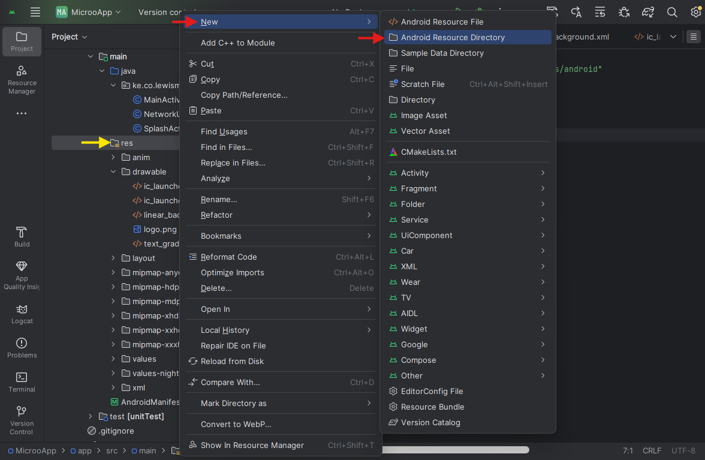
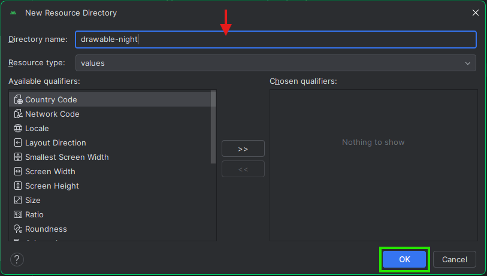

(b). Next, you need to copy from `drawable`: *linear_background.xml* and *text_gradient.xml* then, paste them inside `drawable-night`. Replace **All** the code in the files with the one below. Ensure to switch to `Code` view!:
(i). `linear_background.xml`:
```xml
<?xml version="1.0" encoding="utf-8"?>  
<shape xmlns:android="http://schemas.android.com/apk/res/android"  
    android:shape="rectangle">  
  
    <corners android:radius="14dp" />  
  
    <gradient        android:startColor="@color/primary_dark"  
        android:endColor="@color/primary_dark_darker"  
        android:angle="0"  
        android:type="linear" />  
  
</shape>
```

(ii). `text_gradient.xml`:
```xml
<?xml version="1.0" encoding="utf-8"?>  
<shape xmlns:android="http://schemas.android.com/apk/res/android"  
    android:shape="rectangle">  
  
    <!-- Rounded corners -->  
    <corners android:radius="12dp" />  
  
    <!-- Gradient background -->  
    <gradient  
        android:startColor="@color/ph_primary"  
        android:endColor="@color/primary_dark"  
        android:angle="0"  
        android:type="linear" />  
  
    <!-- Optional: Add padding inside the shape -->  
    <padding  
        android:left="8dp"  
        android:top="4dp"  
        android:right="8dp"  
        android:bottom="4dp" />  
  
</shape>
```

---

13. Click to expand `layout` directory (located below `drawable-night`).
 
 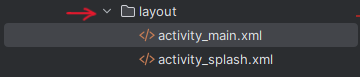

Replace **All** the code for `activity_main.xml` and `activity_splash.xml` with the one below:
(a). `activity_main.xml`:
```xml
<?xml version="1.0" encoding="utf-8"?>  
<androidx.constraintlayout.widget.ConstraintLayout xmlns:android="http://schemas.android.com/apk/res/android"  
    xmlns:app="http://schemas.android.com/apk/res-auto"  
    xmlns:tools="http://schemas.android.com/tools"  
    android:id="@+id/main"  
    android:layout_width="match_parent"  
    android:layout_height="match_parent"  
    tools:context=".MainActivity">  
  
    <WebView        android:layout_width="fill_parent"  
        android:layout_height="fill_parent"  
        android:id="@+id/webView"  
        android:layout_alignParentTop="true"  
        android:layout_alignParentStart="true"  
        android:layout_alignParentBottom="true"  
        android:layout_alignParentEnd="true"  
        tools:ignore="MissingConstraints" />  
</androidx.constraintlayout.widget.ConstraintLayout>
```

(b). `activity_splash.xml`:
```xml
<?xml version="1.0" encoding="utf-8"?>  
<LinearLayout xmlns:android="http://schemas.android.com/apk/res/android"  
    xmlns:tools="http://schemas.android.com/tools"  
    android:layout_width="match_parent"  
    android:layout_height="match_parent"  
    android:orientation="vertical"  
    android:gravity="center"  
    android:background="@drawable/linear_background"  
    tools:context=".SplashActivity">  
  
    <!-- Logo Image -->  
    <FrameLayout  
        android:layout_width="wrap_content"  
        android:layout_height="wrap_content"  
        android:padding="20dp">  
  
        <ImageView            android:id="@+id/logoImageView"  
            android:layout_width="wrap_content"  
            android:layout_height="wrap_content"  
            android:src="@drawable/logo"  
            android:adjustViewBounds="true"  
            android:maxWidth="180dp"  
            android:maxHeight="98dp"  
            android:scaleType="fitCenter"  
            android:contentDescription="@string/app_name" />  
  
    </FrameLayout>  
    <!-- Slogan Text with Animation -->  
    <TextView  
        android:id="@+id/sloganTextView"  
        android:layout_width="wrap_content"  
        android:layout_height="wrap_content"  
        android:text="@string/slogan"  
        android:textSize="14dp"  
        android:textColor="@color/white"  
        android:textStyle="bold"  
        android:layout_marginTop="10dp"  
        android:paddingHorizontal="16dp"  
        android:paddingVertical="8dp"  
        android:padding="6dp"  
        android:fontFamily="sans-serif-condensed"  
        android:visibility="visible"  
        android:letterSpacing="0.03"/>  
  
    <!-- Progress Bar -->  
    <ProgressBar  
        android:layout_width="220dp"  
        android:layout_height="10dp"  
        android:layout_gravity="center_horizontal"  
        style="?android:attr/progressBarStyleHorizontal"  
        android:max="100"  
        android:indeterminate="true"  
        android:progress="0"  
        android:layout_marginTop="60dp"  
        android:progressTint="@color/ph_danger"  
        android:progressBackgroundTint="#33000000"  
        android:indeterminateTint="@color/ph_danger" />  
  
</LinearLayout>
```

---

14. (a). Right-click on `values` directory then select: New> Values Resource File:
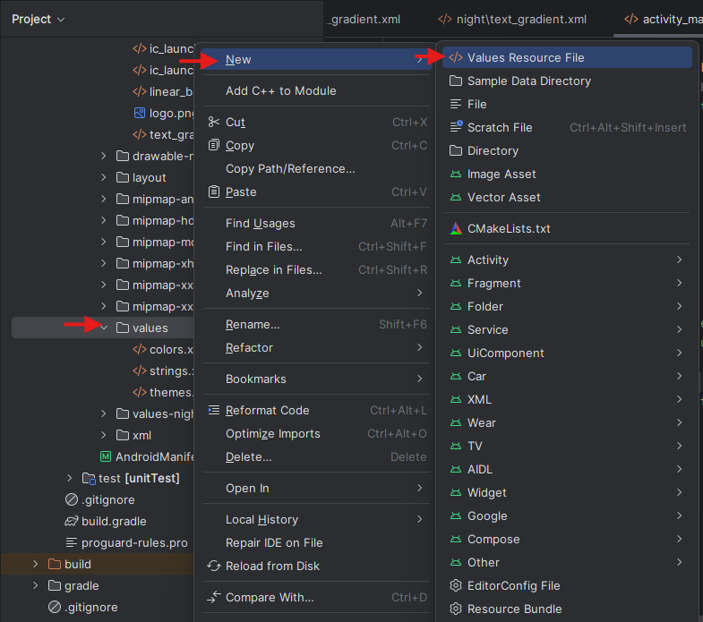

Name the file `ic_launcher_background`:  

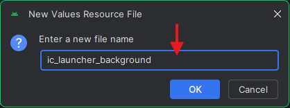

The new `values` structure should be as shown below:  

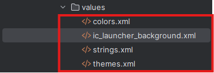

(b). Replace **All** the code for `colors.xml`, `ic_launcher_background.xml`, `strings.xml` and `themes.xml` with the one below. *Change only the values where necessary to fit your preference*:
(i). `colors.xml`:
```xml
<?xml version="1.0" encoding="utf-8"?>  
<resources>  
    <!-- Primary Colors -->  
    <color name="ph_primary">#0072ff</color>  
    <color name="primary_1">#4361ee</color>  
    <color name="primary_dark">#3a0ca3</color>  
    <color name="ph_primary_2">#00c6ff</color>  
  
    <!-- Status Colors -->  
    <color name="ph_success">#00b894</color>  
    <color name="ph_warning">#f39c12</color>  
    <color name="ph_danger">#e74c3c</color>  
  
    <!-- Surface Colors -->  
    <color name="ph_surface">#ffffff</color>  
    <color name="ph_surface_2">#f9fbff</color>  
  
    <!-- UI Colors -->  
    <color name="ph_border">#e6e9f5</color>  
  
    <!-- Background Colors -->  
    <color name="body_background">#f5f7fb</color>  
    <color name="text_primary">#2d3436</color>  
    <color name="text_dark">#1f2d3d</color>  
  
    <!-- Dark mode color (declare in base for compatibility) -->  
    <color name="primary_dark_darker">#3a0ca3</color> <!-- Same as primary_dark for light mode -->  
  
    <!-- Basic Colors -->    <color name="black">#FF000000</color>  
    <color name="white">#FFFFFFFF</color>  
</resources>
```

(ii). `ic_launcher_background.xml`:
```xml
<?xml version="1.0" encoding="utf-8"?>  
<resources>  
    <color name="ic_launcher_background">#FFFFFF</color>  
</resources>
```

(iii). `strings.xml`:
- Replace the `app_name` and `slogan` values with yours.
```xml
<resources>  
    <string name="app_name">MicrooApp</string>  
    <string name="slogan">"Your number one option!"</string>  
</resources>
```

(iv). `themes.xml`:
- Replace `Theme.MicrooApp` with `Theme.YourAppName`.
```xml
<resources xmlns:tools="http://schemas.android.com/tools">  
    <!-- Base application theme. -->  
    <style name="Theme.MicrooApp" parent="Theme.MaterialComponents.DayNight.NoActionBar">  
        <!-- Primary brand color. -->  
        <item name="colorPrimary">@color/ph_primary</item>  
        <item name="colorPrimaryVariant">@color/primary_dark</item>  
        <item name="colorOnPrimary">@color/white</item>  
  
        <!-- Secondary brand color. -->  
        <item name="colorSecondary">@color/ph_primary_2</item>  
        <item name="colorSecondaryVariant">@color/primary_dark</item>  
        <item name="colorOnSecondary">@color/white</item>  
  
        <!-- Background colors -->  
        <item name="android:colorBackground">@color/body_background</item>  
  
        <!-- Surface colors -->  
        <item name="colorSurface">@color/ph_surface</item>  
        <item name="colorOnSurface">@color/text_primary</item>  
  
        <!-- Status bar color - using primary dark for status bar -->  
        <item name="android:statusBarColor">@color/primary_dark</item>  
  
        <!-- Make status bar icons light (for dark background) -->  
        <item name="android:windowLightStatusBar">false</item>  
  
        <!-- Navigation bar color -->  
        <item name="android:navigationBarColor">@color/body_background</item>  
  
        <!-- App bar/elevation background using linear gradient -->  
        <item name="android:windowBackground">@drawable/linear_background</item>  
  
        <!-- Customize your theme here. -->  
    </style>  
</resources>
```

---

The next step is to create `values-night` directory **if it doesn't already exist**.

15. (a). Right click on `res` directory. Select: `New>Android Resource Directory` and name it: `values-night`.
(b). Copy from `values` directory, `colors.xml` and `themes.xml` and paste them inside `values-night`. Replace all the code in the files with the one below:
(i). `colors.xml`:
```xml
<?xml version="1.0" encoding="utf-8"?>  
<resources>  
    <!-- Darker version for night mode gradient -->  
    <color name="primary_dark_darker">#1A0C5F</color>  
  
    <!-- Dark mode adjustments -->  
    <color name="body_background">#0A0A0A</color>  
    <color name="text_primary">#E0E0E0</color>  
    <color name="text_dark">#FFFFFF</color>  
    <color name="ph_surface">#1A1A1A</color>  
    <color name="ph_surface_2">#222222</color>  
    <color name="ph_border">#333333</color>  
</resources>
```

(ii). `themes.xml`:
- Replace `Theme.MicrooApp` with `Theme.YourAppName`.
```xml
<resources xmlns:tools="http://schemas.android.com/tools">  
    <!-- Base application theme for night/dark mode. -->  
    <style name="Theme.MicrooApp" parent="Theme.MaterialComponents.DayNight.NoActionBar">  
        <!-- Primary brand color (same as day for consistency). -->  
        <item name="colorPrimary">@color/ph_primary</item>  
        <item name="colorPrimaryVariant">@color/primary_dark</item>  
        <item name="colorOnPrimary">@color/white</item>  
  
        <!-- Secondary brand color. -->  
        <item name="colorSecondary">@color/ph_primary_2</item>  
        <item name="colorSecondaryVariant">@color/primary_dark</item>  
        <item name="colorOnSecondary">@color/white</item>  
  
        <!-- Background colors - darker for night mode -->  
        <item name="android:colorBackground">@color/body_background</item>  
  
        <!-- Surface colors -->  
        <item name="colorSurface">@color/ph_surface</item>  
        <item name="colorOnSurface">@color/text_primary</item>  
  
        <!-- Status bar color - using primary dark but can be transparent to show gradient -->  
        <item name="android:statusBarColor">@android:color/transparent</item>  
  
        <!-- Make status bar icons light (for dark background) -->  
        <item name="android:windowLightStatusBar">false</item>  
  
        <!-- App bar/elevation background using linear gradient -->  
        <item name="android:windowBackground">@drawable/linear_background</item>  
  
        <!-- Navigation bar color -->  
        <item name="android:navigationBarColor">@color/body_background</item>  
  
        <!-- Customize your theme here. -->  
    </style>  
</resources>
```

---

16. Expand `xml` directory then replace the code: `backup_rules.xml` and `data_extraction_rules.xml` with the one below:
(i). `backup_rules.xml`:
```xml
<?xml version="1.0" encoding="utf-8"?><!--  
   Sample backup rules file; uncomment and customize as necessary.   See https://developer.android.com/guide/topics/data/autobackup   for details.   Note: This file is ignored for devices older than API 31   See https://developer.android.com/about/versions/12/backup-restore-->  
<full-backup-content>  
    <!--  
   <include domain="sharedpref" path="."/>   <exclude domain="sharedpref" path="device.xml"/>-->  
</full-backup-content>
```

(ii). `data_extraction_rules.xml`:
```xml
<?xml version="1.0" encoding="utf-8"?><!--  
   Sample data extraction rules file; uncomment and customize as necessary.   See https://developer.android.com/about/versions/12/backup-restore#xml-changes   for details.-->  
<data-extraction-rules>  
    <cloud-backup>        <!-- TODO: Use <include> and <exclude> to control what is backed up.  
        <include .../>        <exclude .../>        -->    </cloud-backup>  
    <!--  
    <device-transfer>        <include .../>        <exclude .../>    </device-transfer>    --></data-extraction-rules>
```

---

17. Open `AndroidManifest.xml`:
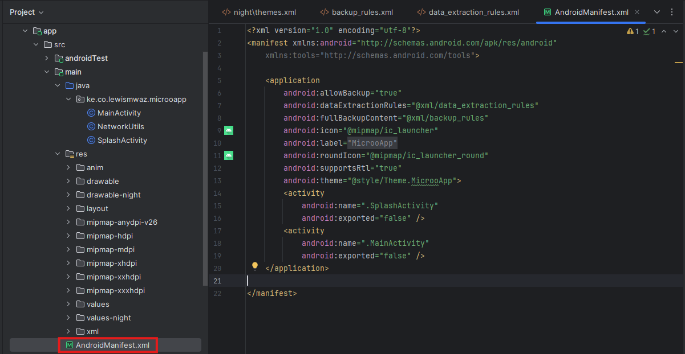

Replace all the code inside `AndroidManifest.xml` with the one below. Ensure the value for `android:theme="@style/Theme.MicrooApp"` matches `YourAppName`:
```xml
<?xml version="1.0" encoding="utf-8"?>  
<manifest xmlns:android="http://schemas.android.com/apk/res/android"  
    xmlns:tools="http://schemas.android.com/tools">  
  
    <!-- Core -->  
    <uses-permission android:name="android.permission.INTERNET" />  
    <uses-permission android:name="android.permission.ACCESS_NETWORK_STATE" />  
  
    <!-- Media / Upload -->  
    <uses-permission android:name="android.permission.CAMERA" />  
    <uses-permission android:name="android.permission.RECORD_AUDIO" />  
  
    <!-- Storage (legacy support only; scoped storage used) -->  
    <uses-permission  
        android:name="android.permission.WRITE_EXTERNAL_STORAGE"  
        android:maxSdkVersion="28" />  
  
    <!-- Notifications (Android 13+) -->  
    <uses-permission android:name="android.permission.POST_NOTIFICATIONS" />  
  
    <application        android:allowBackup="true"  
        android:dataExtractionRules="@xml/data_extraction_rules"  
        android:fullBackupContent="@xml/backup_rules"  
        android:icon="@mipmap/ic_launcher"  
        android:label="@string/app_name"  
        android:roundIcon="@mipmap/ic_launcher_round"  
        android:supportsRtl="true"  
        android:theme="@style/Theme.MicrooApp"  
        tools:targetApi="36">  
  
        <activity            android:name=".SplashActivity"  
            android:exported="true"  
            android:screenOrientation="portrait">  
            <intent-filter>                <action android:name="android.intent.action.MAIN" />  
                <category android:name="android.intent.category.LAUNCHER" />  
            </intent-filter>        </activity>  
        <activity            android:name=".MainActivity"  
            android:exported="true"  
            android:screenOrientation="portrait" />  
  
    </application>  
</manifest>
```

---

18. Build the Project Gradle by clicking `Build` (Left of screen) then click the sync icon (As shown below). Ensure Build is successful (having followed all previous steps correctly) otherwise fix any errors displayed in the Terminal Window:
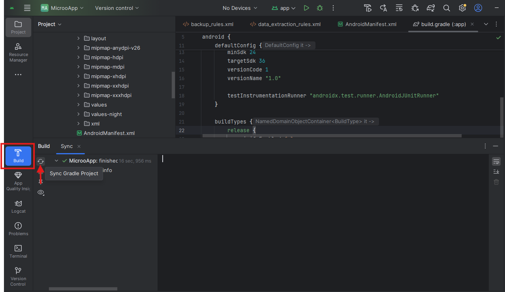
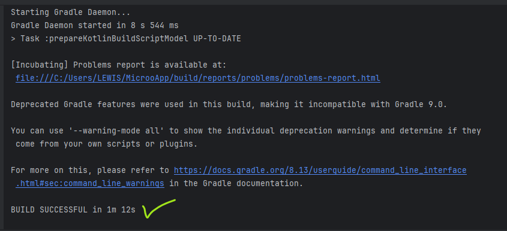

---

19. Let's Create customized App Icons.   
(a). Right-click on `mipmap-anydpi-v26` then select: New> Image Asset.
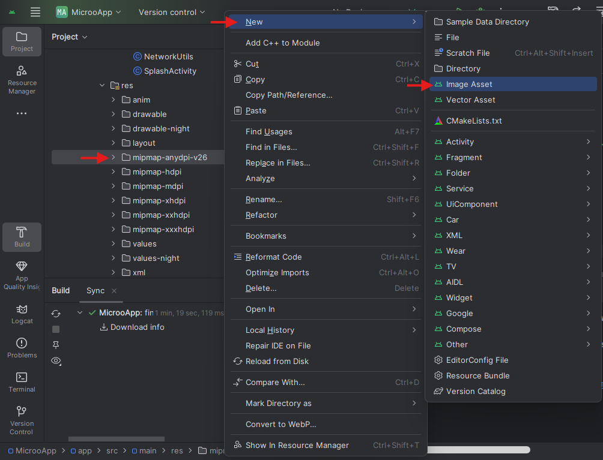

(b). In the next window, customize the size of App Icon and also App icon image using the `Options`, `Background Layer` and `Foreground Layer`. Choose a suitable App logo-image with no-background by choosing from `Path`. Scroll down the `Foreground Layer` in the section `Scaling` and resize the logo perfectly. When satisfied click **Next**:
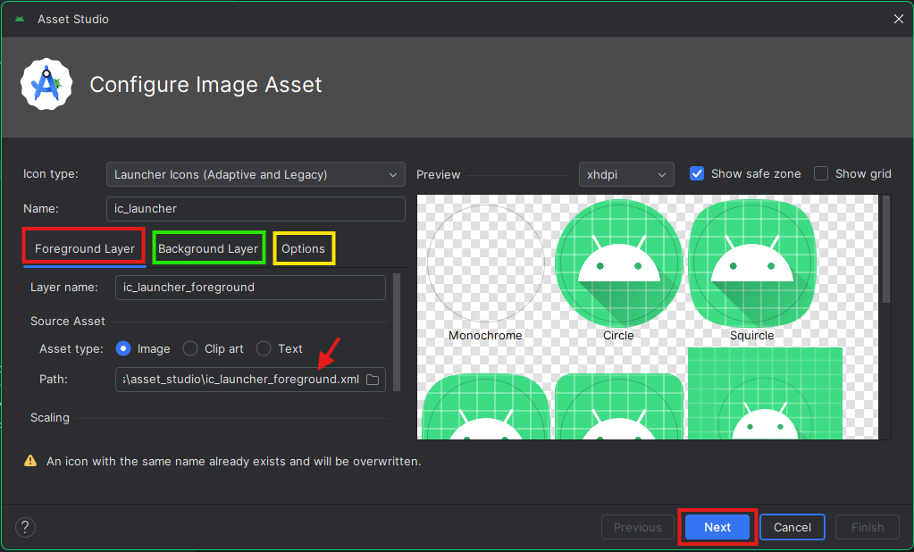
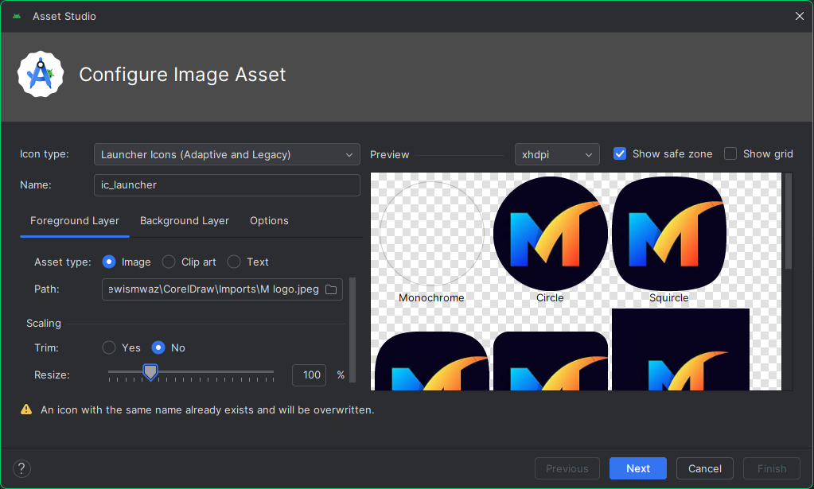

In the next window, just click **Finish**:
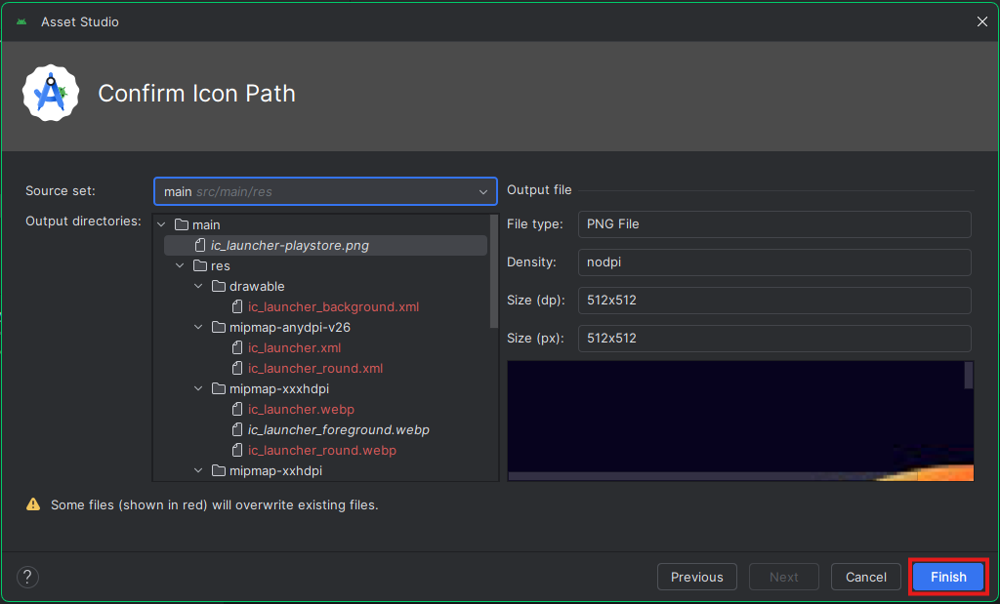

---

20. Now you need to create a unique `Apk signature` that every PlayStore app MUST have, then your Apk. Follow the onscreen instructions below:
(a). Click on the `Main Menu` button (as shown below).
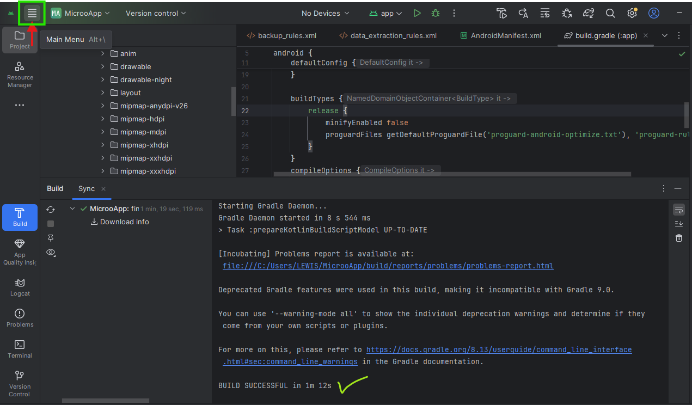
(b). Select `Build`>`Generate Signed App Bundle or Apk`:
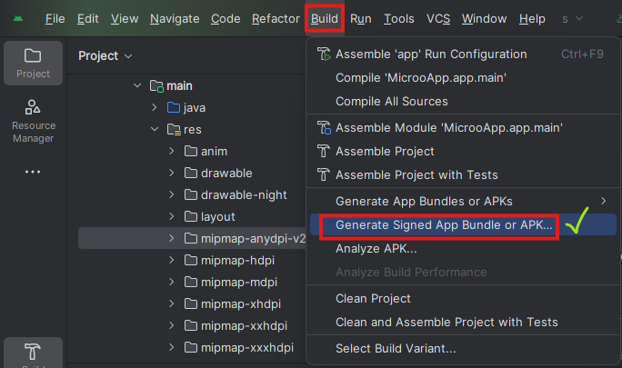
(c). Select `Apk` then click **Next**:
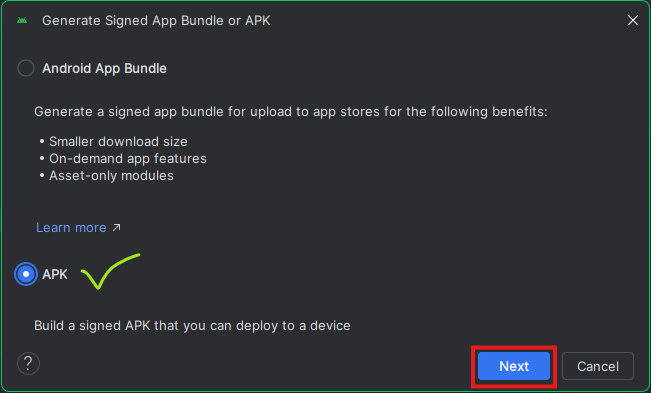

(d). Select `Create new`:
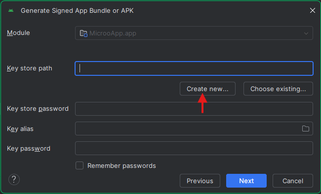  

(e). Select `Key store path`:  

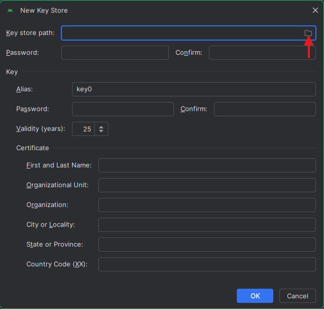  

(f). Create a new folder inside the root of `YourApp` and call it `KeyStore`:
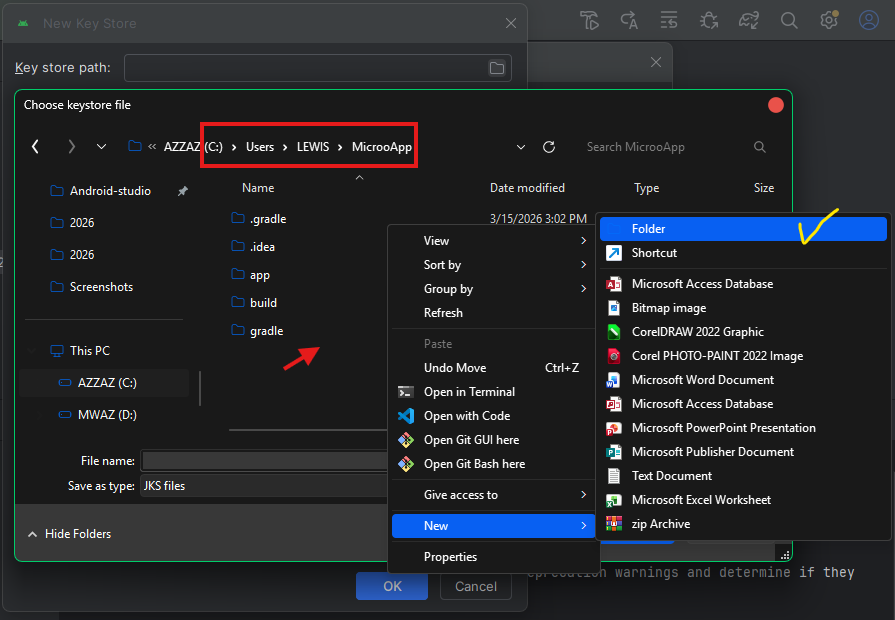
(g). Open the new folder you've just created called `KeyStore`, then provide a File name for your App Signature Key (It's recommended to use `YourAppName`), then click **Save**:
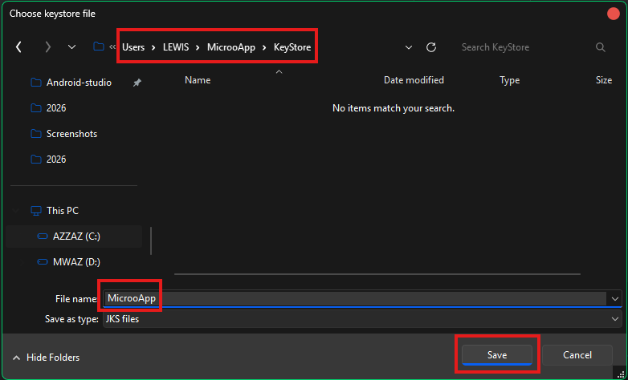
(h).  Create a unique password for your Key. ***Use the same password for Alias*** to avoid any confusion. Rename the Alias from `key0` to `YourAppNamekey0`. Fill in the details below accordingly then click **OK**:
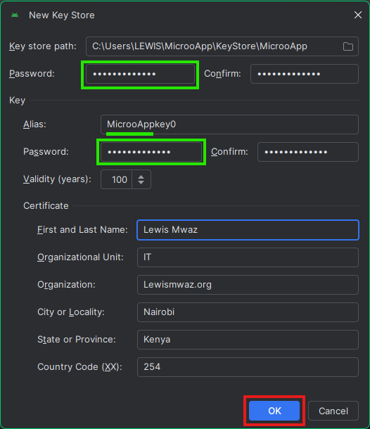  

(i). Select `Remember passwords` (to ensure you don't a password every time you build new apps) then click **Next**.  

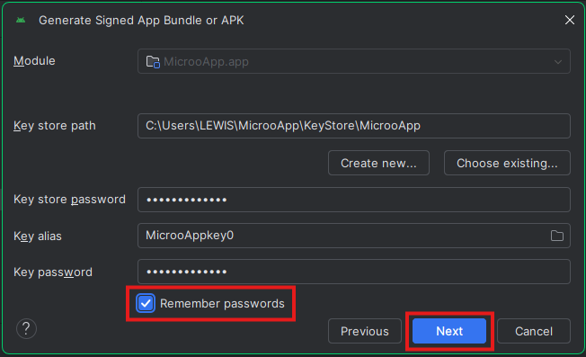  

(j). In the next window, select `release` then click **Create**:
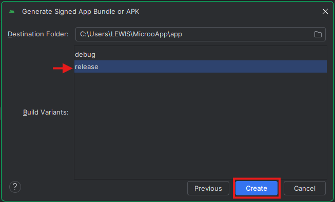  

(k). Successful Apk Build should look like this (below):
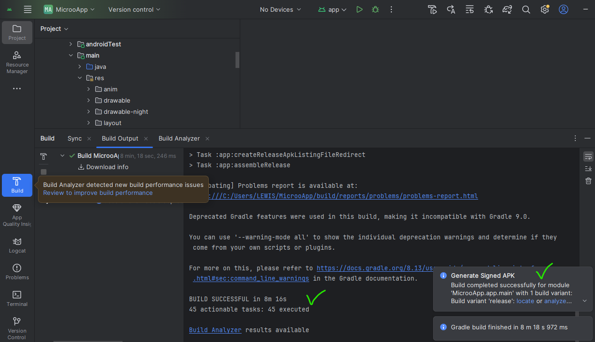

---

21. (a). Locate your `Signed Apk` and test it on your mobile device. By default, the `Signed Apk` should be saved for instance (in this case), inside `C:/Users/LEWIS/MicrooApp/app/release` (as shown below):
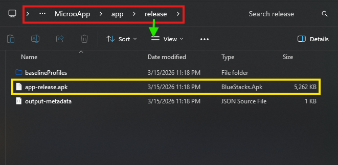

 (b). Send yourself a copy of  your `app-release.apk` to your mobile device, install and Test. 
 > [!NOTE]
 > Having followed all the instructions, your installed App should look professional with a Native feel unlike typical websites (even though it's actually a website).
 
 
